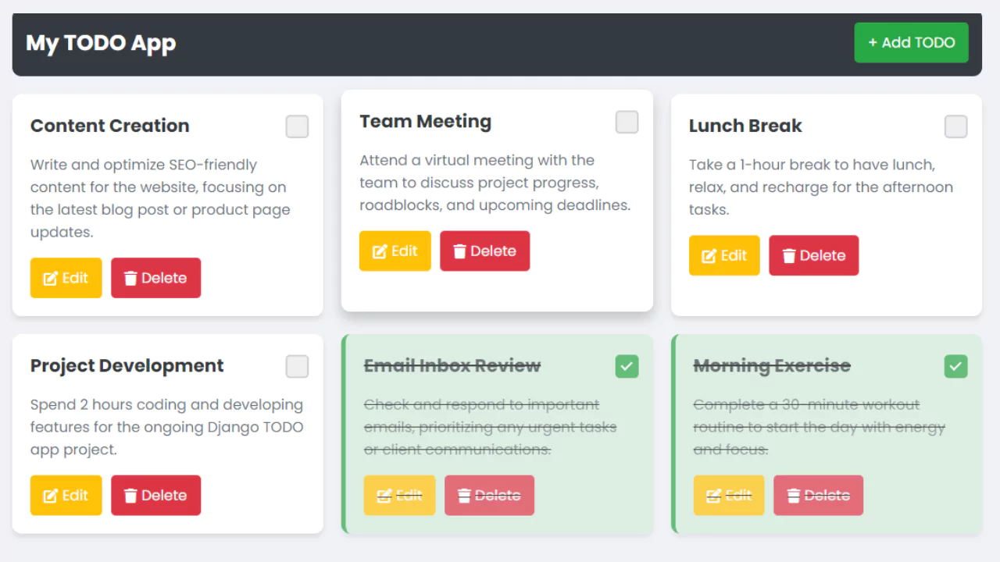

# To-Do webapp using Django and Python


<hr/>

## 1. Setting Up the Development Environment

####  Installing Django

Before starting, ensure you have Python installed. You can install Django using pip:

```
pip install django
```

#### <u style='color:red'>Creating a new Django project</u>

Create a new Django project using the following command:

```
django-admin startproject todo-app-project
```

#### <u style='color:red'>Setting up the project structure</u>

Navigate into your project directory:
```
cd todo-app-project
```

#### <u style='color:red'>Setting up the project structure</u>

Navigate into your project directory:
```
cd todo-app-project
```

#### <u style='color:red'>Create a Django App</u>
Create a new app within your project:

```
 python manage.py startapp todoapp
```

#### <u style='color:red'>Adding the app to the project</u>
In todoproject/settings.py, add todoapp to the INSTALLED_APPS list:
```
 INSTALLED_APPS = [
    'todoapp',
    'django.contrib.admin',
    'django.contrib.auth',
    'django.contrib.contenttypes',
    'django.contrib.sessions',
    'django.contrib.messages',
    'django.contrib.staticfiles',
]
```

## Creating the ToDo App 

#### a. Create Models
In todoapp/models.py, define the model for the TODO items:

```
from django.db import models

class Todo(models.Model):
    title = models.CharField(max_length=200)
    description = models.TextField(blank=True)
    completed = models.BooleanField(default=False)
    created_at = models.DateTimeField(auto_now_add=True)
    updated_at = models.DateTimeField(auto_now=True)

    def __str__(self):
        return self.title
```

#### b. Create Forms

In todoapp, create a new file named forms.py for the TODO model and add the following function:

```
from django import forms
from .models import Todo

class TodoForm(forms.ModelForm):
    class Meta:
        model = Todo
        fields = ['title', 'description', 'completed']
```

#### C. Create Views
Next, we’ll create views for listing, adding, updating, and deleting TODO items. Open todoapp/views.py and add the following:

```
from django.shortcuts import render, redirect, get_object_or_404
from .models import Todo
from .forms import TodoForm

def todo_list(request):
    todos = Todo.objects.all().order_by('-created_at')
    return render(request, 'todo_list.html', {'todos': todos})

def todo_create(request):
    if request.method == 'POST':
        form = TodoForm(request.POST)
        if form.is_valid():
            form.save()
            return redirect('todo_list')
    else:
        form = TodoForm()
    return render(request, 'todo_form.html', {'form': form})

def todo_update(request, pk):
    todo = get_object_or_404(Todo, pk=pk)
    if request.method == 'POST':
        # Check if the 'completed' field is in the POST data
        todo.completed = 'completed' in request.POST
        todo.save()
        return redirect('todo_list')
    else:
        # Render the form if needed (not necessary for the checkbox functionality)
        form = TodoForm(instance=todo)
        return render(request, 'todo_form.html', {'form': form})

def todo_delete(request, pk):
    todo = Todo.objects.get(pk=pk)
    if request.method == 'POST':
        todo.delete()
        return redirect('todo_list')
    return render(request, 'todo_confirm_delete.html', {'todo': todo})
```

#### d. Set Up URL Routing

Add a URL pattern for your view. In todoapp/urls.py (create this file if it doesn't exist), add:

```
from django.urls import path
from . import views

urlpatterns = [
    path('', views.todo_list, name='todo_list'),
    path('create/', views.todo_create, name='todo_create'),
    path('update/<int:pk>/', views.todo_update, name='todo_update'),
    path('delete/<int:pk>/', views.todo_delete, name='todo_delete'),
]
```

Include the app's URLs in your project's URL configuration. Open todoproject/urls.py and include the ToDo app URLs:

```
from django.contrib import admin
from django.urls import path, include

urlpatterns = [
    path('admin/', admin.site.urls),
    path('', include('todoapp.urls')),
]
```

#### e. Create Templates

Create a templates directory within the TODO app and then create base.html, todo_list.html, todo_confirm_delete.html and todo_form.html inside this directory.
##### Base Template (base.html):
```


<!DOCTYPE html>
<html lang="en">
<head>
    <meta charset="UTF-8">
    <meta name="viewport" content="width=device-width, initial-scale=1.0">
    <title>TODO App</title>
    <link rel='stylesheet' href='https://fonts.googleapis.com/css2?family=Poppins:wght@400;500;600;700&amp;display=swap'>
    <link rel="stylesheet" href="">
    <link rel="stylesheet" href="https://cdnjs.cloudflare.com/ajax/libs/font-awesome/6.0.0-beta3/css/all.min.css" />
</head>
<body>
    <div class="container">
        <nav class="navbar">
            <h1>My TODO App</h1>
            <a href="" class="btn btn-add">+ Add TODO</a>
        </nav>
        <div class="content">
            
        </div>
    </div>
<script>
    document.querySelectorAll('.todo-checkbox-form').forEach(form => {
    form.addEventListener('change', function(event) {
        event.preventDefault();
        const formData = new FormData(this);
        fetch(this.action, {
            method: 'POST',
            body: formData,
            headers: {
                'X-CSRFToken': formData.get('csrfmiddlewaretoken')
            }
        }).then(response => {
            if (response.ok) {
                location.reload();
            }
        });
    });
});
</script>
</body>
</html>
```

##### TODO List Template (todo_list.html):

```


<div class="todo-container">
    
    <div class="todo-card completed">
        <div class="todo-header">
            <h2>{{ todo.title }}</h2>
            <form method="post" action="" class="todo-checkbox-form">
                
                <label class="custom-checkbox">
                    <input type="checkbox" name="completed" onchange="this.form.submit()" checked>
                    <span class="checkmark"></span>
                </label>
            </form>
        </div>
        <p>{{ todo.description }}</p>
        <div class="todo-actions">
            <a href="" class="btn btn-edit"><i class="fas fa-edit"></i> Edit</a>
            <a href="" class="btn btn-delete"><i class="fas fa-trash"></i> Delete</a>
        </div>
    </div>
    
</div>

```


#### TODO Form Template (todo_form.html):

```



<div class="add-form-container">
    <h2>{{ form.instance.pk|yesno:"Update TODO,Create TODO" }}</h2>
    <form method="post">
        
        <div class="form-group">
            <label for="id_title">Title</label>
            {{ form.title }}
        </div>
        <div class="form-group">
            <label for="id_description">Description</label>
            {{ form.description }}
        </div>
        <div class="form-group">
            <div class="task-complete-area">
            <label for="id_completed">Completed</label>
                <label class="custom-checkbox">
                    {{ form.completed }}
                    <span class="checkmark"></span>
                </label>
                </div>
        </div>
        <div class="form-actions">
            <button type="submit" class="btn btn-primary">{{ form.instance.pk|yesno:"Update,Create" }}</button>
            <a href="" class="btn btn-secondary">Cancel</a>
        </div>
    </form>
</div>

```

##### TODO Delete Confirmation Template (todo_confirm_delete.html):

```



<div class="delete-container">
    <h2>Are you sure you want to delete "{{ todo.title }}"?</h2>
    <form method="post">
        
        <div class="form-actions">
            <button type="submit" class="btn btn-danger">Yes, delete it</button>
            <a href="" class="btn btn-secondary">Cancel</a>
        </div>
    </form>
</div>

```

##### Add CSS Styling
Create a CSS file named styles.css in todoapp/static/ and add the following styles:

```
  body {
    font-family: 'Poppins', sans-serif;
    background-color: #f0f2f5;
    margin: 0;
    padding: 0;
}

.container {
    width: 80%;
    max-width: 1200px;
    margin: auto;
    padding: 20px;
}

.navbar {
    display: flex;
    justify-content: space-between;
    align-items: center;
    padding: 15px;
    background-color: #343a40;
    color: white;
    border-radius: 10px;
    margin-bottom: 20px;
}

.navbar h1 {
    margin: 0;
    font-size: 24px;
}

.navbar .btn-add {
    background-color: #28a745;
    color: white;
    padding: 10px 15px;
    border-radius: 5px;
    text-decoration: none;
}

.navbar .btn-add:hover {
    background-color: #218838;
}

.content {
    display: flex;
    flex-direction: column;
    gap: 20px;
}

.todo-container {
    display: grid;
    grid-template-columns: repeat(auto-fit, minmax(300px, 1fr));
    gap: 20px;
}

.todo-card {
    background: white;
    padding: 20px;
    border-radius: 10px;
    box-shadow: 0 4px 6px rgba(0, 0, 0, 0.1);
    transition: transform 0.3s, box-shadow 0.3s;
}

.todo-card:hover {
    transform: translateY(-5px);
    box-shadow: 0 8px 15px rgba(0, 0, 0, 0.2);
}

.todo-card.completed {
    background-color: #d4edda;
    border-left: 5px solid #28a745;
}

.todo-card h2 {
    margin: 0;
    font-size: 20px;
    color: #343a40;
}

.todo-card p {
    color: #6c757d;
}

.todo-actions {
    margin-top: 10px;
    display: flex;
    gap: 10px;
}

.btn {
    padding: 10px 15px;
    border: none;
    border-radius: 5px;
    cursor: pointer;
    display: flex;
    align-items: center;
    gap: 5px;
    text-decoration: none;
    color: white;
    transition: background-color 0.3s;
    font-family: 'Poppins', sans-serif;
}

.btn-edit {
    background-color: #ffc107;
}

.btn-edit:hover {
    background-color: #e0a800;
}

.btn-delete {
    background-color: #dc3545;
}

.btn-delete:hover {
    background-color: #c82333;
}

.form-container {
    background: white;
    padding: 20px;
    border-radius: 10px;
    box-shadow: 0 4px 6px rgba(0, 0, 0, 0.1);
}

.add-form-container {
    max-width: 600px;
    margin: 20px auto;
    padding: 20px;
    background-color: #f8f9fa;
    border-radius: 8px;
    box-shadow: 0 4px 8px rgba(0, 0, 0, 0.1);
}

.form-group {
    margin-bottom: 15px;
}

.form-group .task-complete-area{
    display: flex;
    gap: 15px;
}

.form-group label {
    display: block;
    margin-bottom: 5px;
    font-weight: bold;
    color: #333;
}

.form-group input,
.form-group textarea {
    width: 100%;
    padding: 10px;
    border: 1px solid #ced4da;
    border-radius: 5px;
    box-sizing: border-box;
}

.form-group textarea {
    height: 100px;
    resize: none;
}

.form-actions {
    display: flex;
    justify-content: space-between;
    align-items: center;
}

.btn-primary {
    background-color: #007bff;
    color: #fff;
    border: none;
    font-size: 16px;
}

.btn-primary:hover {
    background-color: #0056b3;
}

.btn-secondary {
    background-color: #6c757d;
    color: #fff;
    border: none;
}

.btn-secondary:hover {
    background-color: #5a6268;
}

.delete-container {
    max-width: 500px;
    margin: 20px auto;
    padding: 20px;
    background-color: #f8d7da;
    border-radius: 8px;
    box-shadow: 0 4px 8px rgba(0, 0, 0, 0.1);
    text-align: center;
}

.delete-container h2 {
    color: #721c24;
}

.btn-danger {
    background-color: #dc3545;
    color: #fff;
    border: none;
    font-size: 16px;
    font-weight: bold;
}

.btn-danger:hover {
    background-color: #c82333;
}

.todo-form input, .todo-form textarea {
    width: 100%;
    padding: 10px;
    margin: 10px 0;
    border-radius: 5px;
    border: 1px solid #ced4da;
}

.btn-save {
    background-color: #28a745;
    color: white;
    padding: 10px 15px;
    border-radius: 5px;
    border: none;
    cursor: pointer;
}

.btn-save:hover {
    background-color: #218838;
}

.custom-checkbox {
    position: relative;
    display: inline-block;
    width: 22px;
    height: 22px;
}

.custom-checkbox input {
    opacity: 0;
    width: 0;
    height: 0;
}

.checkmark {
    position: absolute;
    top: 0;
    left: 0;
    height: 22px;
    width: 22px;
    background-color: #eee;
    border-radius: 5px;
    border: 2px solid #ced4da;
    transition: background-color 0.3s;
}

.custom-checkbox input:checked ~ .checkmark {
    background-color: #28a745;
    border-color: #28a745;
}

.checkmark:after {
    content: "";
    position: absolute;
    display: none;
}

.custom-checkbox input:checked ~ .checkmark:after {
    display: block;
}

.custom-checkbox .checkmark:after {
    left: 7px;
    top: 3px;
    width: 5px;
    height: 10px;
    border: solid white;
    border-width: 0 2px 2px 0;
    transform: rotate(45deg);
}

.todo-header {
    display: flex;
    justify-content: space-between;
    align-items: center;
}

.todo-card.completed {
    background-color: #d4edda;
    border-left: 5px solid #28a745;
    text-decoration: line-through;
    opacity: 0.7;
}

```
##### Include Static Files

Make sure Django is configured to serve static files in development. Ensure you have these settings in todoproject/settings.py:
```
STATIC_URL = '/static
```

## Run Your Server

#### Run migrations:

```
python manage.py makemigrations
python manage.py migrate
```

#### Run the development server:

```
python manage.py runserver
```

Open your browser and go to http://127.0.0.1:8000/ to see your TODO app in action.

### <b style='color:yellow'>Full Todo App Project Structure</b>

```
todoproject/
│
├── manage.py
├── db.sqlite3
├── todoproject/
│   ├── __init__.py
│   ├── asgi.py
│   ├── settings.py
│   ├── urls.py
│   ├── wsgi.py
│
├── todoapp/
│   ├── migrations/
│   │   ├── __init__.py
│   │   └── 0001_initial.py
│   ├── __init__.py
│   ├── admin.py
│   ├── apps.py
│   ├── models.py
│   ├── tests.py
│   ├── views.py
│   ├── forms.py
│   ├── urls.py
│   ├── templates/
│   │   │   ├── base.html
│   │   │   ├── todo_list.html
│   │   │   ├── todo_form.html
│   │   │   ├── todo_confirm_delete.html
│   ├── static/
│   │   │   ├── styles.css

```

## Resources :

<a href="https://realpython.com/django-todo-lists/">- django-todo-lists</a>
<br/>
<a href="https://docs.python.org/3.12/">- Pyhton Doc</a>


