<h1>Django: Python Web Development</h1>

<h5>Course Overview</h5>
<p style='text-align:justify'>
Django is a free and open-source web application framework written in Python. It is used for rapid web development and clean, pragmatic design. It is built by experienced developers to make repetitive tasks easier, so you can focus on writing apps instead of reinventing the wheel. This course teaches Django for beginning and intermediate level learners. The course includes a hands-on learning experience with the help of interactive widgets. At the end of the course, you will have created a project in Django that can be used in your portfolio.
</p>

<h4>Course Content</h4>
<ol>
  <li>
   Before Getting Started
   <ul>
     <li>Who is This Course for?</li>
     <li>Learning Outcomes</li>
   </ul>
  </li>

   <li>
   Introduction to Django
   <ul>
     <li>What is Django?</li>
     <li>Companies That Use Django</li>
     <li>Django Design Pattern</li>
     <li>Quiz on Django Basics</li>
   </ul>
  </li>

  <li>
   First Django Application
   <ul>
     <li>Django Project</li>
     <li>Hello World Application</li>
     <li>Static and Dynamic Routing</li>
     <li>Dynamic Routing with Path Converters</li>
     <li>URL Mappings</li>
     <li>Quiz on Django Applications</li>
   </ul>
  </li>

  <li>   
   Templates in Django
   <ul>
     <li>Django Template Engine</li>
     <li>Variables</li>
     <li>Tags and Loops</li>
     <li>Conditionals</li>
     <li>Filters and Comments</li>
     <li>Code Templates in Django</li>
     <li>Relative URLs</li>
     <li>Template Inheritance</li>
     <li>Quiz on Templates</li>
   </ul>
  </li>
    <li>   
   Static Files in Django
   <ul>
     <li>Using Static Files in Django</li>
     <li>Quiz on Static Files</li>
   </ul>
  </li>
    <li>   
   Laying Ground for Songs Playlist Application
  </li>
   <li>   
   
Project Solution: Laying Grounds for Songs Playlist Application
   <ul>
     <li>
Project Solution: Create a Playlist Template</li>
     <li>
Project Solution: Create a Songs Template</li>
<li>
Project Solution: Template Inheritance</li>
<li>
Project Solution: Serve Static Image</li>
   </ul>
</li>
<li>
Django Models
   <ul>
    <li>Models in Django
</li>
    <li>Models in Code
</li>
    <li>Implementing Examples of Models
</li>
    <li>Exploring Model in Admin Interface
</li>
    <li>Built-in Field Validation
</li>
    <li>Many To One Relationship
</li>
    <li>Many To Many Relationship
</li>
    <li>
One To One Relationship
</li>
    <li>
Quiz on Models</li>
   </ul>
</li>
<li>
   Django Forms
  <ul>
    <li> Our First Django Form
    </li>
    <li> 
Render the Form
    </li>
    <li> 
Form Fields
    </li>
    <li> 
Collecting Data via Django Form
    </li>
    <li> 
Basic Form Validation
    </li>
    <li> 
Initial Form Data
    </li>
    <li> 
Form Field Widgets and Labels
    </li>
    <li> 
Model Form
    </li>
  </ul>
</li>
<li>
  
Operations on Models
  <ul>
     <li>
Create a User Model
</li>
<li>
Retrieve and Update the User
</li>
  </ul>
</li>
<li>
Take Your Playlist to the Next Level
  <ul>
    <li>Project Solution: Create Models
</li>
    <li>
Project Solution: Define Relationship</li>
    <li>
Project Solution: Make a Signup Form</li>
    <li>
Project Solution: Make a Login Form
</li>
    <li>
Project Solution: Inserting Users at Sign-Up</li>
    <li>
Project Solution: Authenticate the User at Login</li>
    <li>
Project Solution: Inserting Songs and Playlists</li>
    <li>
Project Solution: Retrieving Songs and Playlists</li>
    <li>
Project Solution: Updating Songs</li>
  </ul>
</li>
</ol>

<hr/>

<h1>
Who is This Course for?
</h1>

### Intended audience

This course is designed for complete beginners who want to learn the Django framework from scratch and for professionals who are looking to bridge any gaps in their knowledge. Python developers that want to learn web development with Django are also welcome to take this course.

### Pre-requisites

To take full advantage of this course, knowledge of the following concepts is a must:
<ul>
   <li>Python and its basic concepts.</li>
   <li>Basic knowledge of HTML and CSS.</li>
   <li>Fundamental knowledge of the Internet—such as the HTTP protocol and the client-server architecture.</li>
   <li>Familiarity with the concept of relational databases and SQL.  
   </li>
</ul>
That’s it! Anyone with knowledge of these concepts can easily follow along with this course.

### What to expect ?
This is a hands-on course. Whenever a topic is covered, you will be required to implement it in Python so that the concept gets solidified immediately. We will be providing you with the correct solutions along the way to help you out. By the end of the course, we will develop a fully-fledged Django application, which will be based on all the concepts that we cover throughout the course. We will be developing a fictional music playl
ist website called “Zing It.”

### Learning Outcomes

Let's take a look at the learning outcomes of this course.

In this course, you will learn:
<ul>
<li>How to create routes (or views) with Django.</li>
<li>How to serve static content and files using Django.</li>
<li>How to connect templates with models to serve data dynamically.</li>
<li>
How to create Models and how to connect them with Templates and Views.</li>
<li>How to work with databases using SQLite.</li>
<li>How to handle and validate forms in Django.
</li>
<li>
How to create Relative URLs with templates and how to check out Template and Custom Filters.
</li>
<li>
How to create User models and forms and implement login and registration.
</li>
</ul>

Finally, the most rewarding outcome of this course is that you will learn:

<ul>
<li>How to build a Django application, hands-on.</li>
</ul>

<hr/>

<h1> Introduction to Django</h1>

<p>Get introduced to Django, its history, its community, and its key features.</p>


<h4>Meet Django</h4>
<p>
Django is a free and open-source web application framework written in Python. It is used for rapid web development and clean, pragmatic design. It is built by experienced developers to make repetitive tasks easier, so we can focus on writing apps instead of reinventing the wheel.
</p>

<h4>The origins of Django</h4>
<p>
Django was created in 2003 when web developers at the Lawrence Journal-World newspaper started using Python for their web development. After creating a number of websites, they started to factor out and reuse lots of common code and design patterns. That common code led to a generic web development framework that was open-sourced as the “Django” project in 2005. Since the original developers were surrounded by those newspaper writers, well-written documentation is a key part of Django. This means that there are excellent references to check out on the official <a href='https://docs.djangoproject.com/en/3.0/'>Django documentation</a> pages.
</p>


<h4>The Django community</h4>

<p>
The Django framework is extremely large, but the Django community is absolutely massive. The community has contributed a lot of third party code for Django. No matter what we are trying to do, there’s a good chance that we will find the solution for it on djangopackages.org. The website includes everything, from authentication and authorization to full-on Django-powered content management systems, from e-commerce add-ons to integrations with Stripe.
</p>

### Django features

Some features that make Django an ideal framework for web application development are as follows:

<ul>
  <li><b>Super fast:</b> Django development is extremely fast. Our ideas can take the shape of a product very quickly.</li>
  <li><b>Fully loaded:</b> Django has dozens of projects that can be integrated to carry out common tasks such as user authentication, authorization, and content administration.</li>
  <li><b>Versatile:</b> Django can be used for almost any kind of project, from CMSs to e-commerce apps to on-demand delivery platforms.</li>
  <li><b>Secure:</b> Django also has support to prevent common security issues, including cross-site request forgery, cross-site scripting, SQL injection, and clickjacking.</li>
  <li><b>Scalable:</b> Django websites can scale fast to meet high traffic demands.</li>
</ul>


### Companies That Use Django

#### Spotify

<p>
Spotify contains a vast amount of data and enables users to listen to music on any device. To handle this, Spotify uses Python alongside Django.
</p>


#### Dropbox
<p>
With Django, Dropbox stores and shares files, synchronizes accounts across multiple devices, and provides file histories.
</p>

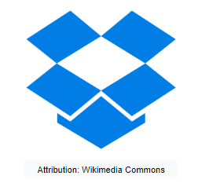

#### Instagram

<p>
Instagram uses many of the tools available with Django, including Sentry, an open source Django app for monitoring and Python error reporting. Instagram features the world’s largest deployment of the Django web framework.
</p>

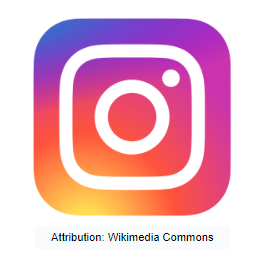

#### Mozilla

<p>
Mozilla uses Python and Django for managing high traffic and improving efficiency. Today, Firefox browser add-ons and the Mozilla support site are built with Django.
</p>

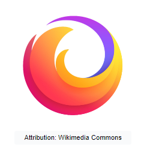

#### Pinterest

<p>
With Django, Pinterest ensures excellent performance and the ability to scale effectively while retaining performance, allowing Pinteresters to follow each other and share boards and pins.
</p>

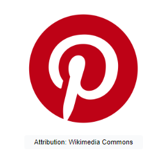

#### National Geographic

<p>
National Geographic has used Django to build a custom CMS to manage the content on their website, from images to advertisements to modules.
</p>


## Django Design Pattern

### Model Template View architecture

<p>
In a traditional data-driven website, a web application waits for HTTP requests from the web browser (or another client). When a request is received, the application works out what is needed based on the URL and any possible information from a POST request or GET request. Depending on what is required, the application may then read or write information from a database, or perform other tasks required to satisfy the request. The application will then return a response to the web browser. The application often dynamically creates an HTML page for the browser to display by inserting the retrieved data into placeholders in an HTML template.
</p>

<p>
Django web applications typically group the code that handles each of these steps into separate files.
</p>

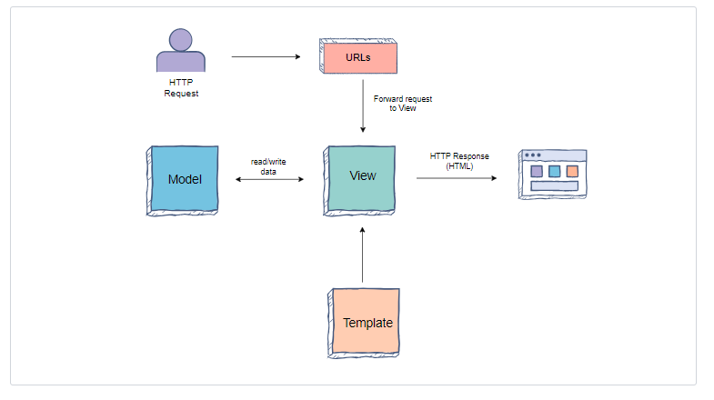

<ul>
<li><b>URLs:</b> While it is possible to process requests from every single URL via a single function, it is much more maintainable to write a separate view function to handle each resource. A URL mapper is used to redirect HTTP requests to the appropriate view based on the request URL. The URL mapper can also match particular patterns of strings or digits that appear in a URL, and pass these to a view function as data.</li>
<li><b>View:</b> A view is a request handler function, which receives HTTP requests and returns HTTP responses. Views access the data needed to satisfy requests via models, and also delegate the formatting of the response to templates.</li>
<li><b>Models:</b> Models are Python objects that define the structure of an application’s data and provide mechanisms to manage (add, modify, delete) and query records in the database.</li>
<li><b>Templates:</b> A template is a text file defining the structure or layout of a file (such as an HTML page), with placeholders used to represent actual content. A view can dynamically create an HTML page using an HTML template, populating it with data from a model. A template can be used to define the structure of any type of file; it doesn’t have to be HTML.</li>
</ul>

## Quiz on Django Basics

1. A ______ is used to redirect HTTP requests to the appropriate view based on the request URL.

    A) View <br>
    B) Model <br>
    C) Template <br>
    D) URL Mapper <br>

2. A ______ is a text file defining the structure or layout of a file, with placeholders used to represent actual content.

      A) Template <br>
      B) Model <br>
      C) View <br>
      D) URL<br>  


<hr/>

<h1>First Django Application</h1>

### Initial set-up for Django

### Creating a Django project
A Django project is a collection of applications and configurations that, when combined together, will make up the full web application, which is a complete website running with Django. We will discuss what a Django application is in the next lesson.

The following command will create a Django project in the first_project directory:

```
django-admin startproject first_project
```

Before running the Django project, let’s look at the files this command created.

```
first_project/
  manage.py
  db.sqlite3
  first_project/
        __init__.py
        settings.py
        urls.py
        asgi.py
        wsgi.py


        first_project hierarchy
```
These files are:
<ul>
  <li>The outer first_project/ root directory, which is a container for our project. Its name doesn’t matter to Django; we can name it anything we like.</li>
  <li>manage.py : A command-line utility that lets us interact with our Django project in various ways.</li>
  <li>The inner first_project/ directory is the actual Python package for our project.</li>
  <li>first_project/__init__.py: This is a blank Python script that, due to its special name, lets Python know that this directory can be treated as a package.</li>
  <li>first_project/settings.py: This is a Python script where we will store all of our project settings.</li>
  <li>first_project/urls.py: This is a Python script that will store all the URL patterns for our project. Basically, it is where we will store the different pages of our web application.</li>
  <li>first_project/views.py: This is a Python script that will handle all of the requests and send an HttpResponse object in return.</li>
  <li>first_project/asgi.py: An entry-point for ASGI-compatible web servers to serve our project.</li>
  <li>first_project/wsgi.py: This is a Python script that acts as the Web Server Gateway Interface. It helps us in deploying our web application to production.</li>
  <li>db.sqlite3: This is a database file where all of the generated data will be stored.</li>
</ul>

### Running the project

Now, let’s run our Django project. The following command is used to run the Django project:

```
python manage.py runserver
```
In the terminal tab

We will see the following output on the command line:

```
Performing system checks...

System check identified no issues (0 silenced).

You have 14 unapplied migration(s). Your project may not work properly until you apply the migrations for app(s): admin, auth, contenttypes, sessions.
Run 'python manage.py migrate' to apply them.

January 06, 2020 - 10:51:26
Django version 2.0.13, using settings 'first_project.settings'
Starting development server at http://0.0.0.0:3000/
Quit the server with CONTROL-C.
```

In the output tab

We will see a “Congratulations!” page with a rocket taking off. It worked!

## Hello World Application

Let’s learn what a Django application is, and how to create our first Hello World Django application.

In the previous lesson, we saw how to create a Django project. In this lesson, we will take a look at how we can create a Django application. In Django terms, the project and application are very different. A project is comprised of multiple different applications.

### What is a Django application?

A Django application is created to perform a particular function for a Django project. For example, a project could have a registration application, a comments application, a polling application, etc.

```
Pluggable Django applications

These Django applications can be plugged into other Django projects, so we can reuse them or use other people’s applications in our project.
```
The following command will create a Django application in the first_project directory:

```
python manage.py startapp first_app 
```

In this example, startapp is the keyword to create the application and first_app is the name of the application that we are creating.

The following files will be included in the first_app directory:

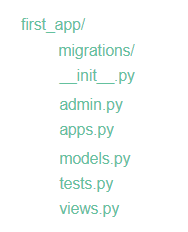


These files are:

<ul>
  <li><b>migrations/:</b> This directory stores database specific information as it relates to the models</li>
  <li><b>__init__.py:</b> This is a blank Python script that, due to its special name, lets Python know that this directory can be treated as a package.</li>
  <li><b>admin.py :</b> This is a Python script where we can register our model classes. We will discuss it further in later chapters.</li>
  <li><b>apps.py :</b> This is a Python script where we can place application-specific configurations.</li>
  <li><b>models.py :</b> This is where we store the application’s data models. We specify the entities and relationships between the data.</li>
  <li><b>tests.py :</b> Here we store the test functions to test our code.</li>
  <li><b>views.py:</b> This is where we have functions that handle requests and return responses.</li>
</ul>

### Running the application

Before we run our first_app application that will show us Hello World!, we need to perform the following steps:

#### Step 1: Add the first_app application

We need to tell Django that we created this application. In order to do this, we need to go to the settings.py file of our project and add the application to the list of installed applications. Open the settings.py file, scroll down, and we will see a bunch of variables. The one that we are looking for is called INSTALLED_APPS. This variable contains the list of applications that Django adds by default, including authorization, administration, messages apps, etc. Let’s add in our first_app application as a string and save the file.

#### Step 2: Add a Hello World view

We need to create a view in our application which shows Hello World! For that we open first_app/views.py file.

First we have to import an HttpResponse object from the django.http module. For this, add the following line:

```
from django.http import HttpResponse

```

Then, we create a view function called index. Each view takes at least one argument—conventionally, we call it a request, but we can call it whatever we want. Each view must return an HttpResponse object. This response object takes a string parameter representing the content of the page. Since we just want to return Hello World!, we add the following lines:

```
def index(request):
    return HttpResponse("Hello World!")
```

<b>NOTE:</b> Each view of this application is going to exist within the views.py file as its own individual function.

```
from django.shortcuts import render
from django.http import HttpResponse

# Create your views here.

def index(request):
    return HttpResponse("Hello World!")
```
#### Step 3: Map a view to a URL

In order to see this view, we have to map it to a URL. Open the first_project/urls.py file. We will see a list of function calls to URLs.

First, we have to import views from first_app:

```
from first_app import views
```
Then, we add the following URL in urlpatterns list:

```
path('',views.index, name='index'),
```

As we can see, the first parameter is the path of the URL.

[
  NOTE: The path means that the given string will be appended to the IP address or DNS name of the server. For example, if the path is 'home', then the URL will be host_name/home. In this case, where we have provided the path '', it will be matched when we don’t enter anything after the DNS name or IP address of the server.
]

The second parameter is the name of a function to which we have mapped this URL, and the third parameter is the name of this specific URL.

```
from django.contrib import admin
from django.urls import path
from first_app import views

urlpatterns = [
    path('',views.index,name="index"),
    path('admin/', admin.site.urls),
]
```

### Execute the example

Now that everything is set, we just need to use the following command to run the server:

```
python manage.py runserver
```

<hr/>

## Static and Dynamic Routing

Let's learn how to create static and dynamic URL routes in our application.

#### What is static and dynamic routing?

Routing can be of two types, static or dynamic. To understand static routing, we can consider a specific URL that leads to a specific page. For example, /home take us to the home page of a website and /about takes us to the about page. However, these are not the only kinds of URLs. In social media sites, we can have URLs such as /profile/101011 and /profile/102045. These URLs lead us to the same page, but depending on the variable part of the URL, the content shown can be different. This is called dynamic routing.

Now, let’s learn how to implement these routing options in Django.

#### Static routing

In static routing, we specify a constant URL string as a path in the urls.py file.

For example, in the mini-application given below, we have specified two static routes with the URLs home/ and educative/ respectively.

📌 NOTE: The path is a case-sensitive string. Therefore, /opentechz and /Opentechz are two different URLs.

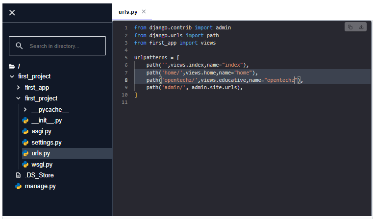

📍 Try this: After running the above code, select the URL given below the Run button to view the webpage in a separate tab. Append /opentechz to the URL and observe the output!

#### Dynamic routing

In dynamic routing, we don’t specify a constant URL path. Instead, we pass a URL with variable parameters in it. The parameters may already be present in the URL itself, or they may be the result of user input.

##### Syntax of dynamic routes

To add a variable in a path, we use it between the angle brackets. For example, <question_id>, where question_id is the name of the variable we pass to the path as the first parameter.

#### Example of dynamic routing

In the example below, we are using a variable path, <age>, where age is a variable, and its value will be equal to whatever the user appends to the URL. This value is then passed to the view function as a parameter.

📍 Try this: After running the code, select the URL given below the Run button to view the webpage in a separate tab. Append /123 or /18 to the URL and observe the output!

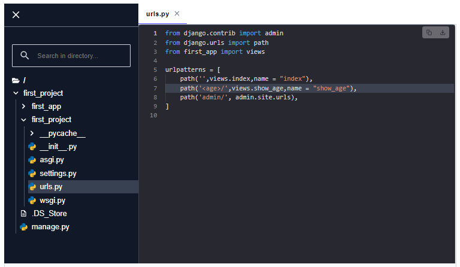

first_project/urls.py file <br>
  At line #7, we passed a variable by the name of age in angle brackets.
first_app/views.py file<br>
  At line #9, we made a function by the name of show_age, and we also passed a parameter age along with the request.

  At line #10, we are returning an HttpResponse, which takes a string where %s indicates a string variable value replacement.


## Dynamic Routing with Path Converters

Let's learn how to use path converters with dynamic URL routes in our application.

In the example from the previous lesson, we used the path <age>, where age was a variable. Then, the value that we appended in the URL at the place of age, that value was passed as a string type parameter to the view function age(). This is the default behavior that the string data type parameters will have. However, we can use a converter to convert this value into another datatype before passing it to the view function. A general use-case for this conversion could be that we want to take the age of the user and apply computations to it to find out if they are eligible for an offer. Therefore, it is appropriate that the age is an integer type variable.

### Path converters
The following are the path  converters available for us to use.

<ul>
   <li><b>str:</b>Matches any non-empty string, excluding the path separator, '/'.</li>
   <li><b>int:</b>Matches zero or any positive integer.</li>
   <li><b>slug: </b>Matches any slug string consisting of ASCII letters or numbers, plus the hyphen and underscore characters. For example, building-your-1st-django-site.</li>
   <li><b>uuid -</b>Matches a formatted UUID.</li>
   <li><b>path - </b>Matches any non-empty string, including the path separator, '/'. This allows us to match against a complete URL path rather than a segment of a URL path, as with str.</li>
</ul>


NOTE: For more details on UUID objects in Python, please refer to their <a href='https://docs.python.org/3/library/uuid.html'>official documentation</a>.

### Example for dynamic routing using path converters

📍 Try this: After running the application, open it in a separate tab using the URL given. Append “/3” to the URL and observe the output. Try with different numbers as well!

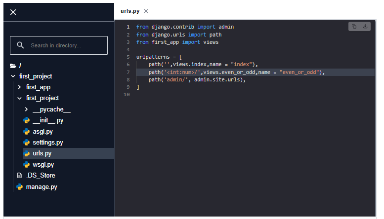

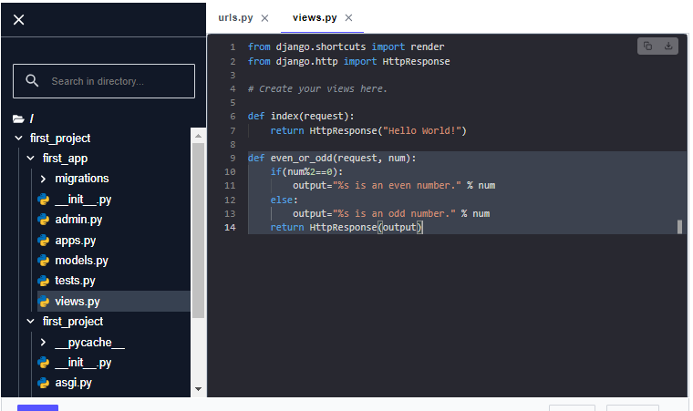

#### first_project/urls.py file
- At line #7, we passed a variable by the name of num in angle brackets, also combined with an int path converter, which will convert the string into an integer.
#### first_app/views.py file
- At line #9, we made a function by the name of even_or_odd, and we also passed a parameter num along with the request.

- From line #10 to line #13, we are checking if the number we passed in the URL is even or not, and then updating the output accordingly.

- At line #14, we are returning an HttpResponse, which takes output as a parameter.

📍 Try this: You must have already tested the above path by appending integers. Now try to test it by appending a random string.


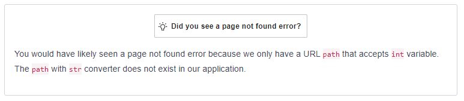


